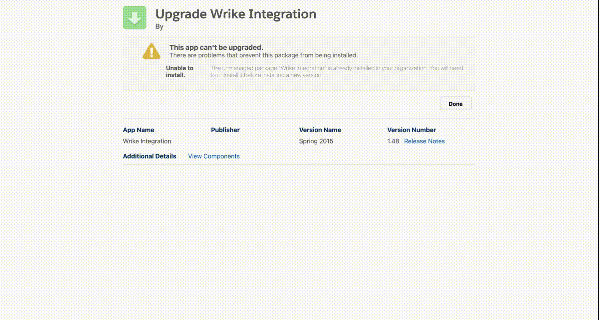

# Wrike Install

## Package
- [Wrike unmanged package](https://login.salesforce.com/packaging/installPackage.apexp?p0=04tj0000001aOGn)




## Package install notes


## Docs
- [Wrike for Salesforce](https://help.wrike.com/hc/en-us/articles/360040085934#UUID-7b2e65ee-9ed0-567c-5544-b6a888027550)

- [ Setting Up Integration With Salesforce ](https://help.wrike.com/hc/en-us/articles/1500005226902#UUID-c53f39ec-78a2-1754-3a59-3ac50d21ab38)

- Wrike Salesforce widget
    - [Wrike’s Salesforce Widget](https://help.wrike.com/hc/en-us/articles/1500005226922-Wrike-s-Salesforce-Widget)

## Wrike ERD

```
sfdx mohanc:md:describe  -u  mohan.chinnappan.n_ea2@gmail.com  -s WrikeAccountSettings__c,Wrike_API__c,Wrike_Bindings__c,WrikeAccountSettings__ChangeEvent,Wrike_API__ChangeEvent,Wrike_Bindings__ChangeEvent -e wrike.svg > wrike-erd.csv

```

- 
- [wrike erd csv](./erd/wrike-erd.csv)